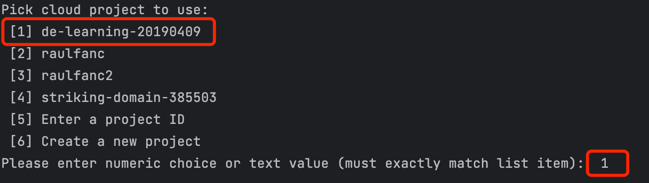

# Day 5. Terraform

## 1. What is Terraform?
1. Used for provisioning infrastructure resources
2. Can version, reuse, and share. Managing configuration files in source control
3. IaC, infrastructure as code

## 2. Setup with Terraform
recommended to use a seperate [variable.tf](terraform/variables.tf) file to store all the variables, for example, those repeated parameters can be passed from the [variable.tf](terraform/variables.tf). i.e., `region`, to avoid typo, keep all resources in the same region to reduce latency
example
```terraform
  # main.tf
  # Concatenating DL bucket & Project name for unique naming
  name          = "${local.data_lake_bucket}_${var.project}" 
```

```terraform
# variables.tf
# my project id as a reminder when creating with terraform
variable "project" {
  description = "de-learning-20190409"   
}
```

## 3. Execution steps
1. `terraform init`: Initializes & configures the backend, installs plugins/providers, & checks out an existing

   configuration from a version control
2. `terraform plan`: **when adding more resources**, Matches/previews local changes against a remote state, and proposes an Execution Plan.

3. `terraform apply`:Asks for approval to the proposed plan, and applies changes to cloud


4. `terraform destroy`: Removes your stack from the Cloud


---

# GCP

1. GCP is similar to MS Azure and Amazon AWS
2. we will use BIGQUERY for data storage and analysis
3. GCP bucket to store raw data

##### GCP Setup for the first time

1. registered GCP for free ($300 credit for new signups, need a credit card)
2. create a new project: `de-learning-20190409`
3. Setup service account & authentication for this project (an account with restricted permissions)

- Grant `viewer` role to begin with.
- Download service-account-keys (.json) for auth. key is save in [day5 folder](../day5-terraform_gcp)
- add this key to `.gitignore` to avoid uploading.

4. Download [gcloud](https://cloud.google.com/sdk/docs/install-sdk) SDK for local setup

- sdk: /Users/admin/Google/google-cloud-sdk
- `.zshrc` to export $PATH to [/Users/admin/.zshrc.backup].

5. cd to the [root folder] `cd /Users/admin/Google/` and run `./google-cloud-sdk/bin/gcloud init`
6. pop into login page to authorise access to GCP
7. choose the project `de-learning-20190409`
   
8. Set the environment variable to point to your downloaded JSON key file:

```bash
export GOOGLE_APPLICATION_CREDENTIALS="<path/to/your/service-account-authkeys>.json"
```

9. Refresh the token/session and verify the authentication:

```bash
gcloud auth application-default login
```


##### Trouble shoot

if Zshell cannot find `gcloud` related commands, use `source ~/.zshrc` to restart it


### Setup for Access

1. [IAM Roles](https://cloud.google.com/storage/docs/access-control/iam-roles) for Service account:

- Go to the IAM section of IAM &
  Admin [https://console.cloud.google.com/iam-admin/iam](https://console.cloud.google.com/iam-admin/iam)
- Click the Edit principal icon for your service account.
- Add these roles in addition to **Viewer**, **Storage Admin** **Storage Object Admin** **BigQuery Admin**, more info
  refer to [IAM Role for this project](GCP_IAM_roles.md#iam-roles-that-relevant-to-this-project)
  

2. Enable these APIs for your project (refer
   to [APIs for this project](GCP_IAM_roles.md#apis-that-relevant-to-this-project)

- [https://console.cloud.google.com/apis/library/iam.googleapis.com](https://console.cloud.google.com/apis/library/iam.googleapis.com)
- [https://console.cloud.google.com/apis/library/iamcredentials.googleapis.com](https://console.cloud.google.com/apis/library/iamcredentials.googleapis.com)

3. Please ensure`GOOGLE_APPLICATION_CREDENTIALS` env-var is set.

```bash
export GOOGLE_APPLICATION_CREDENTIALS="<path/to/your/service-account-authkeys>.json"
```

4. using terraform to create a Storage Bucket/BigQuery in GCP

